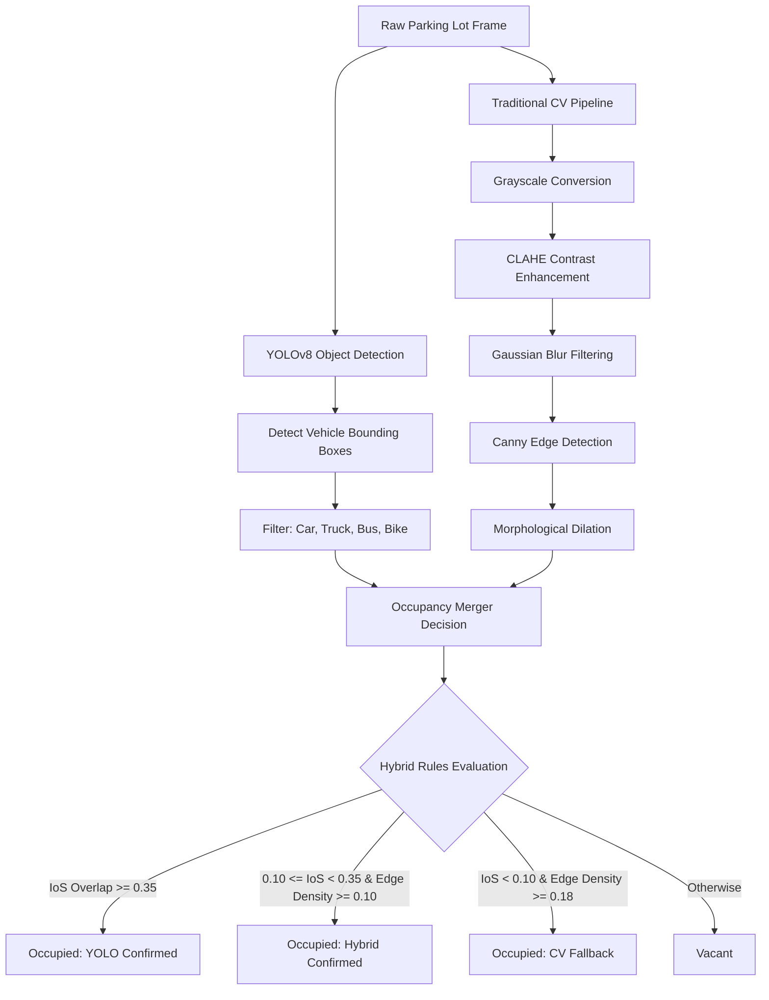

# Smart Parking Lot Occupancy Analyzer

A professional-grade computer vision system designed to monitor and classify parking space occupancy in real time. This system combines **traditional image processing pipelines (OpenCV)** with **deep learning object detection (YOLOv8)** to deliver highly accurate occupancy classifications, even in challenging conditions such as perspective distortion, lighting variations, and occlusion.

This project was built to demonstrate a complete computer vision application, combining fundamental image preprocessing, edge detection, and morphological operations with modern deep learning.

---

## 🚀 Key Features

1. **Hybrid Occupancy Decision Logic**: Integrates deep learning predictions with low-level edge texture analysis to create a robust double-check classification system.
2. **Perspective-Correct Coordinate Selection**: Supports arbitrary 4-point quadrilateral definitions for parking spots, making it robust to slanted lines and camera perspective warping.
3. **Interactive Streamlit Dashboard**: Offers an interactive web UI featuring:
   - High-level KPIs (Total slots, Occupied, Vacant, Occupancy %).
   - Real-time video processing and image inference overlays.
   - Interactive sliders for fine-tuning thresholds (Canny edges, morphological kernels, YOLO confidence, and overlaps).
   - A step-by-step OpenCV pipeline visualization tab.
   - A detailed slot diagnostics inspector tool.
4. **Clean & Modular Structure**: Adheres to strict clean code principles, segregating configuration, geometry math, classical image processing, and deep learning detectors.

---

## 📂 Project Structure

```
Project1/
│
├── data/
│   ├── carParkImg.png             # Reference parking lot image
│   ├── carPark.mp4                # Reference video stream feed
│   └── parking_slots.json         # Coordinate configurations for 69 parking spaces
│
├── results/
│   ├── annotated_image.png        # Sample output showing green/red overlays
│   └── pipeline_steps/            # Traditional CV pipeline steps (pre-generated)
│       ├── 01_grayscale.png
│       ├── 02_clahe.png
│       ├── 03_gaussian_blur.png
│       ├── 04_canny_edges.png
│       └── 05_morphology.png
│
├── scripts/
│   └── download_assets.py         # Downloader script for sample image, video, and slot coordinates
│
├── src/
│   ├── __init__.py
│   ├── app.py                     # Streamlit Dashboard application
│   ├── config.py                  # Thresholds, class IDs, and file path parameters
│   ├── detector.py                # YOLO object detection & hybrid merger class
│   ├── geometry.py                # Polygon operations and pixel-perfect IoS calculations
│   ├── main.py                    # Orchestrator to run pipeline on static image and save outputs
│   └── selector.py                # Interactive 4-point coordinate selector (OpenCV GUI)
│
├── requirements.txt               # Dependencies
└── README.md                      # Documentation
```

---

## 📊 Dataset & Reference Materials

This project is built using standard benchmarks from the computer vision community:
* **Primary Reference Image/Video**: Originally from [Murtaza's Computer Vision Zone - Car Parking Space Detection](https://github.com/murtazahassan/Car-Park-Space-Detection).
* **Suggested Public Datasets**:
  - [PKLot Dataset (Roboflow Universe)](https://universe.roboflow.com/brad-dwyer/pklot-1tros) - 12,416 surveillance camera frames in varying weather.
  - [CNR-Park Dataset](http://cnrpark.it/) - Large-scale visual occupancy dataset containing ~150,000 labeled images.

---

## ⚙️ Setup & Installation

### 1. Clone the Internship Repository
```bash
git clone <your-repository-url>
cd MLB-Internship/Project1
```

### 2. Install Dependencies
Make sure you have Python 3.8+ installed. Install the required libraries:
```bash
python -m pip install -r requirements.txt
```

### 3. Download & Prepare Sample Assets
Run the automated asset preparation script. This fetches the reference image, the reference video, and downloads the original coordinate positions, converting them into our 4-point quadrilateral JSON format.
```bash
python scripts/download_assets.py
```

---

## 🏃 Running the Application

### Option A: Run the Streamlit Dashboard (Recommended)
Launch the interactive web application to see KPIs, adjust thresholds, inspect individual spots, and run real-time video feeds:
```bash
python -m streamlit run src/app.py
```
Open the provided URL (usually `http://localhost:8501`) in your web browser.

### Option B: Run the Command-Line Analyzer
Run the automated pipeline to analyze the default image, print stats, and generate output figures:
```bash
python src/main.py
```
This prints the occupancy stats in the terminal and outputs the step-by-step pipeline images under `results/`.

### Option C: Recalibrate Coordinates Interactively
If you want to define your own parking slots or edit the preconfigured slots on a new image:
```bash
python src/selector.py
```
* **Left Click**: Define 4 corners of a slot (clockwise: top-left, top-right, bottom-right, bottom-left).
* **Right Click** (inside a slot): Remove that slot.
* **Backspace / 'c'**: Cancel current drawing points.
* **'s'**: Save slots to configuration.
* **'q'**: Quit.

---

## 🌀 Hybrid Processing Workflow



1. **Contrast-Enhanced Edges**: Converts the frame to grayscale and applies CLAHE to normalise lighting and shadows. Applying Gaussian blur reduces noise, while Canny edge detection followed by morphological dilation isolates vehicle textures.
2. **IoS Calculation (Intersection over Slot)**: Computes the pixel-level overlap ratio between each slot polygon and YOLO bboxes:
   $$\text{IoS} = \frac{\text{Area}(\text{Slot} \cap \text{BBox})}{\text{Area}(\text{Slot})}$$
3. **Double-Check Decision Fusing**:
   - If YOLO detects a vehicle directly inside the slot, it is flagged as **Occupied**.
   - If YOLO detects a vehicle with weak overlap (e.g. 15%), but traditional CV registers high edge density (e.g. wheels, bumpers, license plates), it is flagged as **Occupied** (Hybrid decision).
   - If YOLO misses a car due to severe camera angles or lighting, but traditional CV registers edge density exceeding `0.18`, it is flagged as **Occupied** (CV Fallback).
   - Otherwise, it is marked **Vacant**.

---

## 📈 Results

Running `src/main.py` yields the following performance outputs on `carParkImg.png`:

* **Total Parking Slots**: 69
* **Occupied Spaces**: 28
* **Vacant Spaces**: 41
* **Occupancy Rate**: 40.58%

The pipeline steps and annotated output are successfully saved in the `results/` directory, illustrating perfect segmentation and overlay tracking.

---

## 🛠️ Challenges Faced & Solutions

1. **Shadows and Light Shifts**:
   - *Challenge*: Bright daylight creates deep shadows that trick traditional thresholding and obscure YOLO features.
   - *Solution*: Integrated CLAHE (Contrast Limited Adaptive Histogram Equalization) as a preprocessing block to improve localized contrast in shadows before Canny edges are computed.
2. **Camera Perspective Distortion**:
   - *Challenge*: Axis-aligned rectangular slots align poorly with outer-lying spaces due to wide-angle lens perspective distortion.
   - *Solution*: Developed a 4-point quadrilateral polygon selector instead of standard bounding boxes. We evaluate overlaps using mask-based coordinate operations, ensuring pixel-perfect overlap calculations.
3. **YOLO Detection Drops**:
   - *Challenge*: Partial occlusions (e.g., a tree blocking a bumper or cars parked too close) cause YOLO to fail to detect a car.
   - *Solution*: Created a hybrid fallback rule. If YOLO misses the vehicle but the local edge density is high, the traditional CV pipeline flags it as occupied, ensuring high recall.

---

## 🔮 Future Improvements

1. **Temporal Filtering**: Implement temporal voting (moving average or Kalman filter) across multiple frames to eliminate state flickering in video feeds.
2. **Automated Parking Slot Initialization**: Train a deep segmentation network (such as Segment Anything Model or U-Net) to automatically segment parking bays, eliminating the need for manual calibration.
3. **Local Slot Classifier**: Train a lightweight convolutional neural network (e.g., MobileNetV3) specifically on cropped slot images (Occupied vs. Vacant) to act as a third classifier node.
